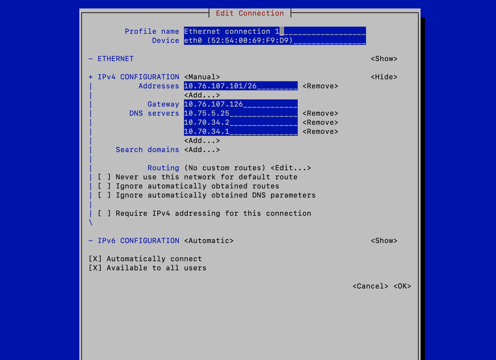

# Ansible Tower Setup

## 1.0 Get the lab IP address 

    Host : 10.76.107/26
    Gateway: 10.76.107.126
    DNS: 10.75.5.25
         10.70.34.2
         10.70.34.1
    Using below IP for controller and managed VM node
         Controller - 10.76.107.101
           Managed  - 10.76.107.102
                      10.76.107.102
                      10.76.107.103
                      10.76.107.104

## 2.0 Login to IP 10.76.107.65 using ssh

    skhobrag@Sunils-MacBook-Pro ~ % ssh root@10.76.107.65
    root@10.76.107.65's password:
    Last login: Sun Dec 19 17:11:51 2021 from 10.74.16.48
    -bash: warning: setlocale: LC_CTYPE: cannot change locale (UTF-8): No such file or directory
    [root@osp1 ~]#

### 2.1 Create a qcow2 file for VM

    [root@osp1 ~]# mkdir /home/VMS/rhaap
    [root@osp1 ~]# cd /home/VMS/rhaap
    [root@osp1 rhaap]wget "https://access.cdn.redhat.com/content/origin/files/sha256/df/df9660e770711f797b311a04946ce45db19843ddb1c60ccadca8b77fa0444e4f/rhel-8.4-x86_64-kvm.qcow2?user=5f40868c6008cf612bb98fbc613aaf93&_auth_=1634154596_c138222c0c71c398676ae8400d98e1c6" -O rhel-8.4-x86_64-kvm.qcow2
    [root@osp1 rhaap]# cp rhel-8.4-x86_64-kvm.qcow2 ansible-tower.qcow2
### 2.2 Resizing the qcow2 file to 50GB  by adding 40GB to 10GB
    
    [root@osp1 rhaap]# qemu-img resize ansible-tower.qcow2 +40G
    Image resized.
    [root@osp1 sunil]# qemu-img info ansible-tower.qcow2
    image: ansible-tower.qcow2
    file format: qcow2
    virtual size: 50G (53687091200 bytes)
    disk size: 694M
    cluster_size: 65536
    Format specific information:
    compat: 0.10
    [root@osp1 sunil]#

### 2.3 Setting the root password to the qcow2 file 

    [root@osp1 tools]$ sudo virt-customize -a bastion.qcow2 --root-password password:redhat
    [   0.0] Examining the guest ...
    [  19.9] Setting a random seed
    [  19.9] Setting the machine ID in /etc/machine-id
    [  20.0] Setting passwords
    [  21.5] Finishing off
    [rajsingh@mylaptop tools]$

## 3.0 Create a VM for Controller Machine
    [root@osp1 ~]# virsh list
    setlocale: No such file or directory
    Id    Name                           State
    ----------------------------------------------------
    1     Ami-Controller                 running
    [root@osp1 ~]# 

    [root@osp1 rhaap]# virt-install --name sunil-ansible-tower  --os-variant=rhel8.0 --ram=8096 --vcpus=2 --disk=/home/VMS/rhaap/ansible-tower.qcow2,device=disk,bus=virtio,format=qcow2 --network bridge=br_prov --network bridge=br_external  --noautoconsole --vnc --import
    
    Starting install...
    Domain creation completed.
    [root@osp1 rhaap]# 

## 3.2 Setting the hostname and FQDN
    skhobrag@Sunils-MacBook-Pro ~ % ssh root@10.76.107.101
    root@10.76.107.101's password:
    Web console: https://sunil-ansilbe-tower.sunil.local:9090/ or https://10.76.107.101:9090/
    
    This system is not registered to Red Hat Insights. See https://cloud.redhat.com/
    To register this system, run: insights-client --register
    
    Last login: Sun Dec 19 06:38:20 2021 from 10.76.107.101
    [root@sunil-ansilbe-tower ~]# hostnamectl set-hostname sunil-ansilbe-tower.sunil.local
    [root@sunil-ansilbe-tower ~]# hostname
    sunil-ansilbe-tower.sunil.local

## 3.1 Setting the IP

## 3.1 Adding the IP and Hostname to /etc/hosts file

    [root@sunil-ansilbe-tower ~]# cat /etc/hosts
    127.0.0.1   localhost localhost.localdomain localhost4 localhost4.localdomain4
    ::1         localhost localhost.localdomain localhost6 localhost6.localdomain6
    10.76.107.101 sunil-ansible-tower.sunil.local sunil-ansible-tower
    [root@sunil-ansilbe-tower ~]#

## 3.2 Create .ssh and copy it
    [root@sunil-ansilbe-tower ~]# ssh-keygen
    [root@sunil-ansilbe-tower ~]# ssh-copy-id localhost

    

## 4.0 Creating 3 VM for managed machine
    [root@osp1 rhaap]# virt-install --name sunil-managednode0  --os-variant=rhel8.0 --ram=2048 --vcpus=1 --disk=managed-node0.qcow2,device=disk,bus=virtio,format=qcow2 --network bridge=br_prov --network bridge=br_external  --noautoconsole --vnc --import

    Starting install...
    Domain creation completed.
    [root@osp1 rhaap]# virt-install --name sunil-managednode1  --os-variant=rhel8.0 --ram=2048 --vcpus=1 --disk=managed-node1.qcow2,device=disk,bus=virtio,format=qcow2 --network bridge=br_prov --network bridge=br_external  --noautoconsole --vnc --import
    
    Starting install...
    Domain creation completed.
    [root@osp1 rhaap]# virt-install --name sunil-managednode2  --os-variant=rhel8.0 --ram=2048 --vcpus=1 --disk=managed-node2.qcow2,device=disk,bus=virtio,format=qcow2 --network bridge=br_prov --network bridge=br_external  --noautoconsole --vnc --import
    
    Starting install...
    Domain creation completed.
    [root@osp1 rhaap]#
    [root@osp1 rhaap]#
    [root@osp1 rhaap]# virsh list
    setlocale: No such file or directory
    Id    Name                           State
    ----------------------------------------------------
    1     Ami-Controller                 running
    85    sunil-ansible-tower            running
    87    sunil-managednode0             running
    88    sunil-managednode1             running
    89    sunil-managednode2             running
    
    [root@osp1 rhaap]#

## 5.0 Registering the VM to Redhat 

    subscription-manager
    43  subscription-manager register
    44  subscription-manager status

## 6.0  Download the "Ansible Automation Platform 1.2.4 Setup Bundle" and extract from url https://access.redhat.com/downloads/content/480/ver=1.2/rhel---7/1.2/x86_64/product-software

    [root@sunil-ansilbe-tower ~]#
    [root@sunil-ansilbe-tower ~]# mkdir -p ansible-tower
    [root@sunil-ansilbe-tower ~]# cd ansible-tower/
    [root@sunil-ansilbe-tower ansible-tower]#tar -xvf ansible-automation-platform-setup-bundle-1.2.4-1.tar.gz 
    [root@sunil-ansilbe-tower ansible-tower]# ls -la    
    total 699484
    drwxr-xr-x. 3 root root       125 Dec  8 02:36 .
    dr-xr-x---. 3 root root       179 Dec  8 02:27 ..
    drwxr-xr-x. 7 root root       209 Jul 29 10:11 ansible-automation-platform-setup-bundle-1.2.4-1
    -rw-r--r--. 1 root root 716271394 Dec  8 02:35 ansible-automation-platform-setup-bundle-1.2.4-1.tar.gz

## 6.1 Go to ansible directory take inventory file backup amd edit the inventory file 

    [root@sunil-ansilbe-tower ansible-tower]# cd ansible-automation-platform-setup-bundle-1.2.4-1/
    [root@sunil-ansilbe-tower ansible-automation-platform-setup-bundle-1.2.4-1]# ls -la
    total 64
    drwxr-xr-x.  7 root root   230 Dec  8 03:51 .
    drwxr-xr-x.  3 root root   125 Dec  8 02:36 ..
    -rw-r--r--.  1 root root  2506 Jul 29 10:10 README.md
    -rw-r--r--.  1 root root   626 Jul 29 10:10 backup.yml
    drwxr-xr-x.  4 root root    28 Jul 29 10:13 bundle
    drwxr-xr-x.  3 root root    33 Jul 29 10:11 collections
    drwxr-xr-x.  2 root root    17 Jul 29 10:10 group_vars
    -rw-r--r--.  1 root root  8521 Jul 29 10:10 install.yml
    -rw-r--r--.  1 root root  2942 Dec  8 02:54 inventory
    -rw-r--r--.  1 root root  2915 Dec  8 02:52 inventory.bkp
    drwxr-xr-x.  3 root root  8192 Jul 29 10:11 licenses
    -rw-r--r--.  1 root root  1335 Jul 29 10:10 rekey.yml
    -rw-r--r--.  1 root root  3492 Jul 29 10:10 restore.yml
    drwxr-xr-x. 21 root root  4096 Jul 29 10:10 roles
    -rwxr-xr-x.  1 root root 10819 Jul 29 10:10 setup.sh
    [root@sunil-ansilbe-tower ansible-automation-platform-setup-bundle-1.2.4-1]#

add the IP address 10.76.107.101
admin_password="redhat"
pg_password='redhat'

    [root@sunil-ansilbe-tower ansible-automation-platform-setup-bundle-1.2.4-1]# ./setup.sh 

## 6.2 Open the browser and give IP address 10.76.107.101

    Select the ...
    
    60 Day Product Trial of Red Hat Ansible Automation Platform, Self-Supported (100 Managed Nodes)
    
    MANAGED NODES 100 EXPIRES 1 Feb 2022 10:29

Login using user 'admin' and password 'redhat'

